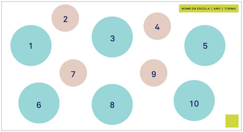
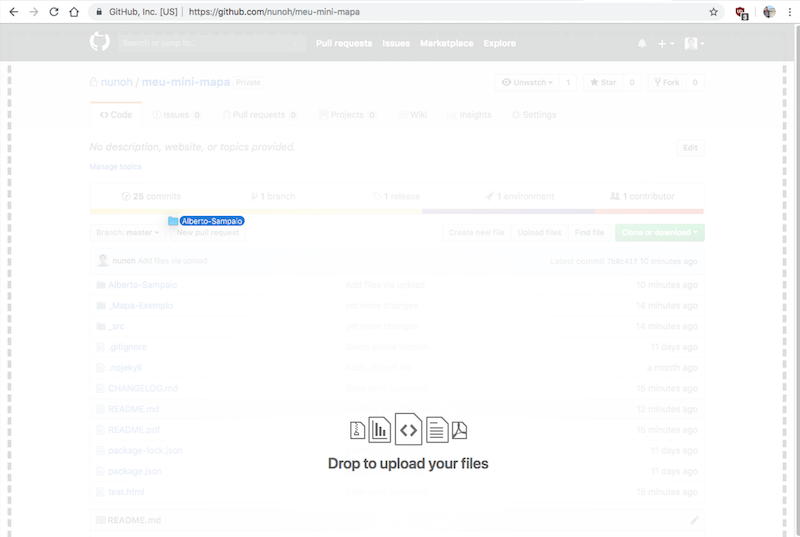
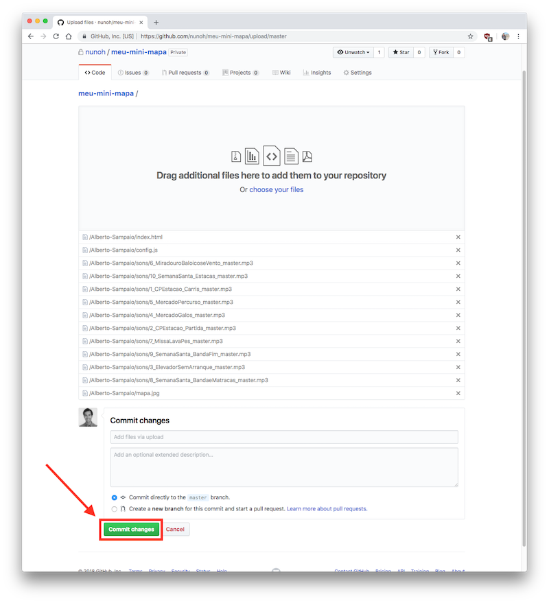
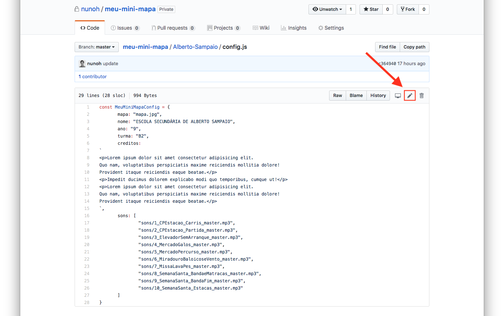
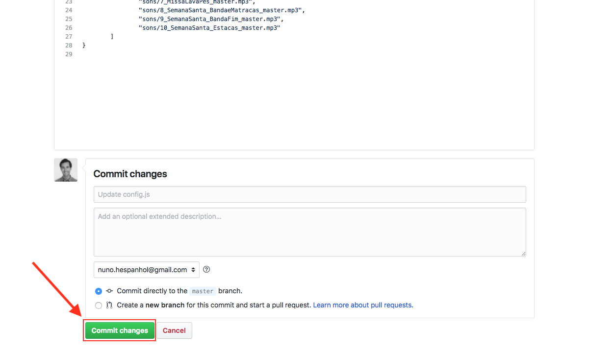
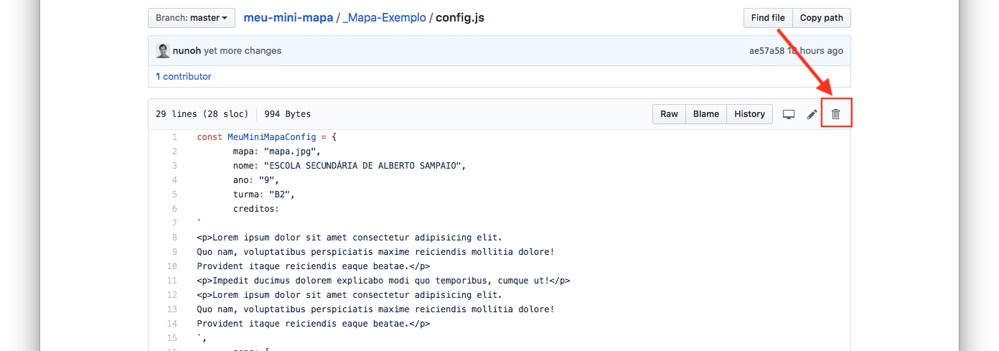

## Guia Meu Mini Mapa

Instruções:
- [Criar um novo mapa](#criar-um-novo-mapa)
- [Publicar um mapa](#publicar-um-mapa)
- [Alterar um mapa já publicado](#alterar-um-mapa-já-publicado)
- [Apagar um mapa](#apagar-um-mapa)

## Criar um novo mapa

1. Duplicar pasta `_Mapa-Exemplo`.

2. Mudar o nome da pasta duplicada para o nome desejado que corresponderá ao url de acesso. Por exemplo: `Alberto-Sampaio`.

3. Alterar o ficheiro `mapa.jpg` para ficheiro do mapa novo desejado.

**NOTA:** _O formato das imagens esperado é de 1920x1346, tomado como referência a partir do exemplo providenciado aquando de fase de desenvolvimento._

4. Adicionar/Substituir ficheiros de sons à pasta `sons`. Embora não seja obrigatório, é boa ideia que sejam em formato `.mp3` (192kbps) de maneira a que a página carregue mais rápido.

5. Editar ficheiro `config.js` com os dados do mapa. O formato do ficheiro deverá ser bastante intuitivo e fácil de entender. No entanto, seguem-se algumas notas explicativas:

O campo `creditos` permite usar HTML para formatação, onde se pode usar tags de parágrafo (`
texto a apresentar
`) para introduzir espaçamento entre linhas.

O campo `sons` consiste na lista dos sons a serem utilizados, segundo a seguinte ordem:

    

## Publicar um mapa

Depois de seguir as instruções anterior, será necessário fazer o upload dos ficheiros para o Github, de maneira a que ficam disponíveis na internet.

1. Entrar no link do projeto: https://github.com/bragamediaarts/meu-mini-mapa.

2. Arrastar a pasta do mapa para a interface, tal como mostra a imagem.

    

3. Depois de ter feito o upload, clica-se no botão "Commit changes", tal como indica a figura.

    

4. Neste momento, assim que acabar de processar, o novo mapa estará disponível (pode demorar até uns 5 minutos, mas normalmente é quase instantâneo), através do nome da pasta, neste caso: https://bragamediaarts.github.com/meu-mini-mapa/Alberto-Sampaio.

## Alterar um mapa já publicado

1. Entrar na página do repositório do Github: https://github.com/bragamediaarts/meu-mini-mapa.
2. Entrar na pasta do mapa que se pretende editar. Neste caso, vamos considerar o `Alberto-Sampaio`.
3. Para editar os dados, clicar no ficheiro `config.js` e depois carregar no botão de edição tal como indica a figura:

    

4. Depois de efetuadas as alterações necessárias, clicar no botão "Commit changes". As alterações ficarão automaticamente disponíveis no site passados alguns segundos/minutos.

    

## Apagar um mapa

Para apagar um mapa, será preciso apagar no Github todos os ficheiros dessea mapa, um por um. Depois de todos os ficheiros apagados, a pasta é automaticamente apagada e o mapa deixa de estar também disponibilizado.

    

Sendo um processo manual que leva algum tempo, refere-se que também é possível usar um programa como o [Github Desktop](https://desktop.github.com/) para sincronizar uma pasta local com a pasta no Github. Está fora do âmbito deste guia explicar como usar o Git/Github, mas de uma maneira sucinta é um processo semelhante ao Dropbox, com a particularidade de que a sincronização nao é automática e quando se faz a sincronização é preciso escrever uma pequeno mensagem.
